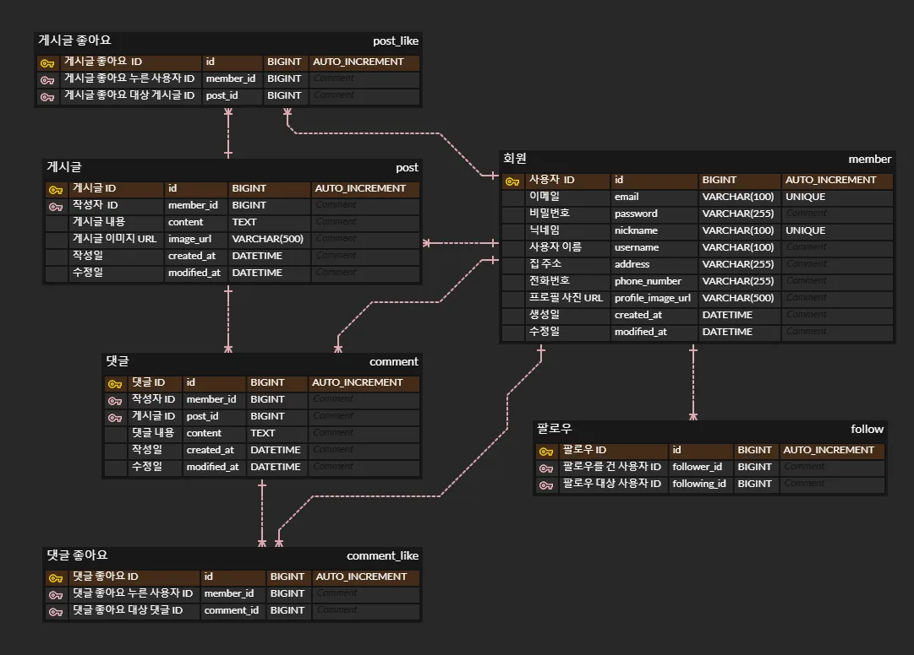
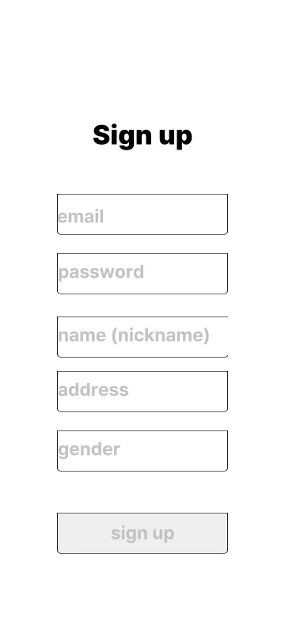
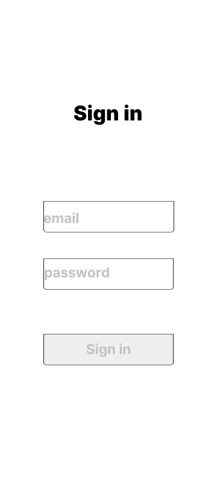
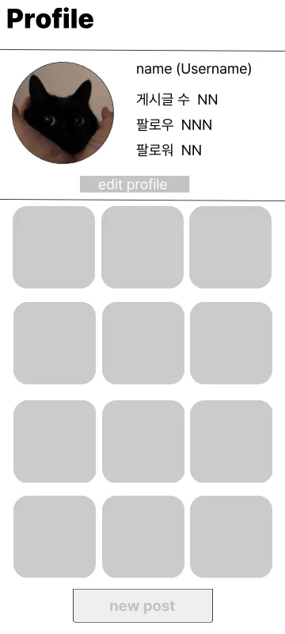
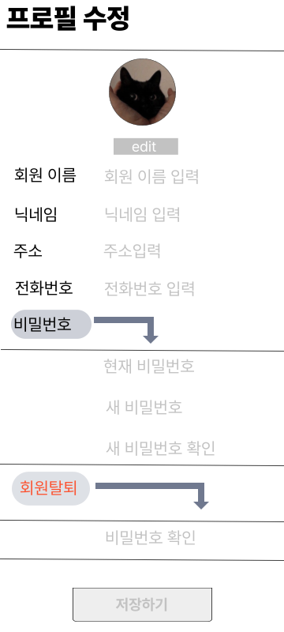
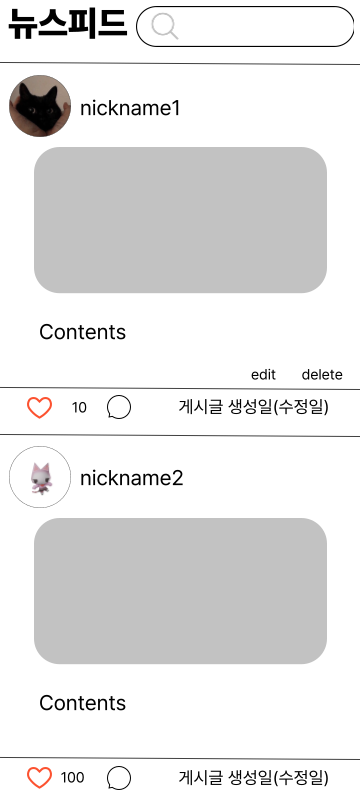
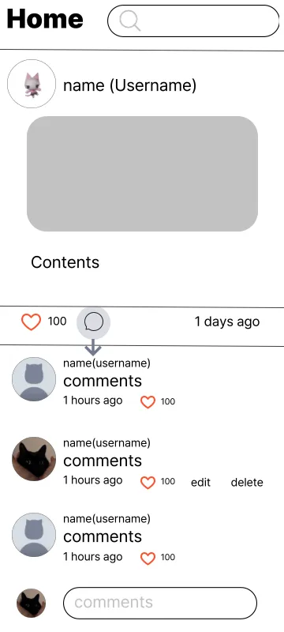

# NewsFeed

## 프로젝트 개요

- 프로젝트명: SixteenFlow
- 프로젝트 소개: SixteenFlow는 인스타그램이나 X(구 트위터)처럼, 팔로우 기반 뉴스피드를 중심으로 동작하는 SNS의 백엔드 기능을 클론한 API 프로젝트입니다. 게시글, 댓글, 좋아요, 친구 추가 등 SNS의 핵심 기능을 빠르고 구조적으로 구현할 예정이며, 스피디한 개발과 유연한 아키텍처 흐름을 함께 경험하는 데 초점을 맞췄습니다.

## Git 컨벤션
| 태그       | 설명                                       |
|------------|--------------------------------------------|
| `feat`     | 새로운 기능 추가                           |
| `fix`      | 버그 수정                                  |
| `refactor` | 코드 리팩토링 (기능 변화 없이 구조 개선)   |
| `docs`     | 문서 수정 (예: README, 주석 등)            |
| `chore`    | 기타 설정, 빌드, 패키지 등                 |

## 개발 환경

| 항목              | 내용                                         |
|-------------------|--------------------------------------------|
| 언어              | Java 17 (JDK 17)                            |
| 프레임워크        | Spring Boot 3.2.5                           |
| 빌드 도구         | Gradle                                      |
| 데이터베이스      | MySQL 8.x                                   |
| DB 접근 방식       | Spring Data JPA                             |
| 검증 라이브러리    | Spring Boot Starter Validation (`@Valid`)   |
| 보안 라이브러리    | Spring Security, JWT (jjwt)        |
| 코드 생성 및 보일러플레이트 제거 | Lombok                      |
| API 테스트 도구    | Postman                                     |
| 테스트 라이브러리  | Spring Boot Starter Test                    |
| IDE               | IntelliJ IDEA                               |

## ERD

## 와이어 프레임
| 회원가입 | 로그인 |
|----------|--------|
|  |  |

| 프로필 조회              | 프로필 수정                  |
|---------------------|-------------------------|
|  |  |

| 게시글 작성              |
|---------------------|
|  |

| 홈                       | 댓글 작성                 |
|-------------------------|-----------------------|
|  |  |

## 느낀점

### 김도균
- 이번 프로젝트를 통해 ERD를 설계하는데 이해도가 한층 상승했습니다.(연관관계 설정)
- 깃허브 브랜치 전략을 처음 사용해보았는데, 정말 어려웠습니다...
- 초반 설계 할 때, API 명세서의 중요성을 느꼈습니다.
- 팀장으로서 부족했지만, 팀원들이 너무 잘 따라주셔서 행복했습니다.
- JPA 사용 시, 굳이 양방향을 사용 안해도 되겠다를 느꼈습니다.
- JPA에서 지연로딩과 즉시로딩의 차이를 알았습니다.(Eager, Lazy)

### 문정호

### 유진원

### 장경혁
- 팀 프로젝트에서의 협업 개발은 처음엔 낯설고 어려웠지만, 많은 것을 배우는 계기가 되었습니다.
- 예상보다 실수도 많았지만, 팀원들이 코드에 대해 질문하고 피드백해주면서 다양한 관점으로 되돌아보고 더 나은 코드를 작성할 수 있었습니다. 
- 이전 과제들을 진행하면서 번거롭고 필요성을 느끼지 못했던 API 명세 작성이, 협업간에는 매우 중요하다고 깨달았습니다.
- 나 혼자만 이해하는 코드가 아닌, 팀원 모두가 쉽게 이해할 수 있는 코드를 작성하는 것이 중요하다는 점을 명심하게 됐습니다.
### 황다현

## 👨‍👩‍👧‍👦 팀원 소개

| 이름  | 직책 | GitHub                                                 | 담당 기능                                          |
|-----|------|--------------------------------------------------------|------------------------------------------------|
| 김도균 | 팀장 | [github.com/dogyun-kim](https://github.com/dogyun-kim) | 게시글 도메인 개발                                     |
| 문정호 | 팀원 | [github.com/RanRanFry](https://github.com/RanRanFry)   | 댓글 도메인 개발                                      |
| 유진원 | 팀원 | [github.com/Jindnjs](https://github.com/Jindnjs)       | 공통 응답 개발(예외처리, 응답 등등), 팔로우 도메인 개발              |
| 장경혁 | 팀원 | [github.com/kcc5107](https://github.com/kcc5107)       | 회원 도메인 개발, Spring security + JWT를 활용한 인증/인가 구현 |
| 황다현 | 팀원 | [github.com/myu-dev00](https://github.com/myu-dev00)     | 좋아요 도메인 개발                                     |
